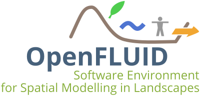

  
  

**OpenFLUID is a software environnement for modelling and simulation of complex landscape systems**

Further informations are available on the [OpenFLUID](https://www.openfluid-project.org/) site at [www.openfluid-project.org](https://www.openfluid-project.org/).

See also the LICENSE and AUTHORS files included in the sources.  

## OpenFLUID sources 

The OpenFLUID source tree is organized as follow
- cmake : CMake files included in main build system 
- doc: Doxygen and LaTeX sources for users and developers manuals
- examples : examples of projects and simulators
- resources : general resources (translations, building, testing and packaging)
- share : shared resources used at runtime
- src : sources of the OpenFLUID framework and applications

### Requirements

OpenFLUID is written in C++14. It relies on open-source libraries required to build or use OpenFLUID.

For the OpenFLUID framework libraries:
  - C++ STL
  - Boost (headers only, testing libs are required in debug mode)
  - Qt5 : Core, GUI (optional), Network, XML
  - RapidJSON (automatically downloaded if locally missing)
  - GDAL/OGR
  - GEOS (optional)

For openfluid command line application:
  - OpenFLUID framework libraries
  - C++ STL
  - Qt5 : Core 

For openfluid-builder GUI application:
  - OpenFLUID framework libraries
  - C++ STL
  - Qt5 : Core, GUI, SVG
  - GDAL/OGR

For openfluid-devstudio GUI application:
  - OpenFLUID framework libraries
  - C++ STL
  - Qt5 : Core, GUI

For unit testing, the Boost unit testing framework is also required 
(unit_test_framework)

For building Latex documents (optional), required tools and packages are:
  - pdflatex
  - latex2html
  - packages: babel, geometry, ltxtable, pgf/tikz, tabularx, verbatim
  - fonts: cmbright

OpenFLUID uses CMake version 3.1 or higher for build configuration and GCC 5.3 or higher for compilation.

### Building from source

Detailed instructions for building OpenFLUID from sources are available on the [OpenFLUID community site](https://community.openfluid-project.org/)

